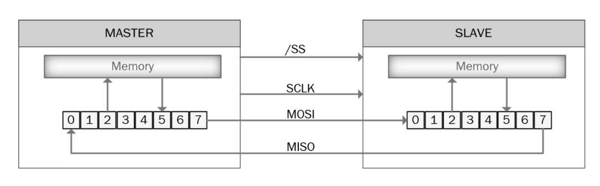
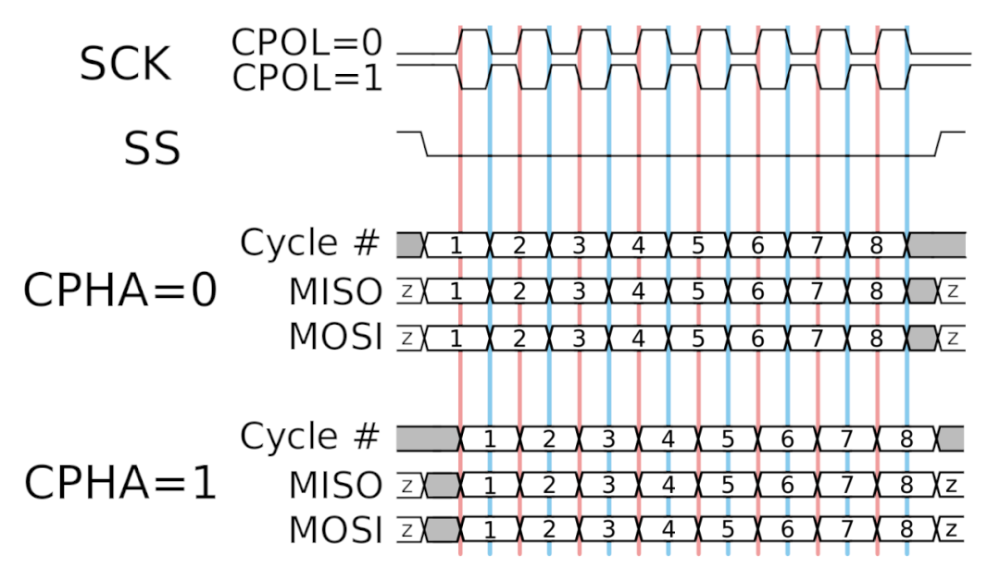

# Protocolo `SPI` (SERIAL PERIPHERAL INTERFACE)

Éste es el protocolo de memoria designado para el funcionamiento de la memoria `RAM`. Es necesario conocer cómo funciona antes de implementarlo al sistema y para esa finalidad se mencionan aquí las características más importantes. 

El nombre del protocolo, por sus siglas en inglés, significa interfaz de periféricos en serie. Es un bus de interfaz usado comunmente para la comunicación entre microcontroladores y periféricos que trabaja con línea de reloj, datos y selección separadas.
Aunque el protocolo es serial, no consiste en el serial convensional con TX y RX asíncrono sin control sobre las líneas de datos; no se sabe cuándo se envían los datos ni se asegura que estén sincronizados con un único reloj (obligatorio en equipos de computación). Para corregir los problemas producto de la asincronía en el protocolo convencional, se crearon algunos métodos para permitir la lectura correcta de los datos como: 

* Establecer una velocidad de transmisión previa al envío de un byte.
* La aparición de bits de inicio y parada en cada que permitían al receptor corregir las pequeñas diferencias en la velocidad de transmisión.

Aunque el protocolo serial convencional funcionaba, se generaba mucha carga por la presencia de los bits adicionales y podían producirse errores.


## La solución seríal síncrona (`SPI`)
Para corregir los problemas en la diferencia del reloj del protocolo serial convencional se creó el protocolo `SPI`. El `SPI` consistía en un bus de datos síncrono, lo que implicaba su sincronía total con el receptor y con ello la presencia de líneas separadas de datos y reloj. La línea del reloj es una señal oscilante que le indica al receptor cúando muestrear los bits de las líneas de datos; pudiendo ser durante el flanco ascendente (subiendo) o descendente (bajando) -se especifica cuál de los dos usar en una hoja de datos-. En el instante en el que el receptor detecte ese flanco, pasa a la lectura del siguiente bit y puesto que se envía un línea de reloj no es necesario especificar la velocidad lo que facilita que el dispositivo/hardware sea más sencillo que en el caso asíncrono (y de menor precio).


Aunque esto soluciona la parte correspondiente al envío de información, aún falta definir como se recibe la información.

### Líneas `CIPO`/`COPI` según última modificación de la OSHWA o `MISO`/`MOSI` según el estándar habitual.

En `SPI` la señal del reloj (`CLK` o `SCK`) es enviada desde un único lado denominado controlador (microcontrolador spiram_ctrl.v) y el lado que la recibe se denomina periférico (chip de memoria); aunque pueden haber muchos periféricos, sólo hay un controlador. Cuando los datos se envían hacia el periférico desde el controlador se hace por una línea denominada `COPI` (controller out-peripheral in) y cuando se envían del periférico al controlador se denominan `CIPO` (controller in-peripheral out). En este caso pueden haber dos líneas de datos, de forma que cuando el controlador envía información al periférico lo hace mediante la línea de `COPI` y si el periférico necesita enviar una respuesta lo hará mediante otra línea llamada `CIPO` conservando la sincronización con los ciclos de reloj del controlador (no desaparecen).


Puesto que existe una velocidad de reloj preestablecida en `SPI` eso permite al controlador saber cuándo y cuántos datos se van a recibir de un periférico. A propósito de las dos líneas de datos, según sea el caso del periférico se podrán estar leyendo y escribiendo datos en simultáneo.

### Línea `CS`

Otra línea presente en el protocolo SPI habla del tipo de chip, denominada `*CHIP SELECT*`. Como su nombre lo indica permite seleccionar un periférico específico para darle la orden de recibir/enviar datos. Esta línea suele permanecer alta para desconectar el periférico del bus. Ates del envío de los datos (`COPI` o `CIPO`) se baja la señal para habilitar el periférico y vuelve a subir después de que termina. 


### Conexión múltiple periféricos `SPI`

Existen dos formas de conexión múltiple de periféricos `SPI`: 

1. Líneas `CS` independientes:
Los periféricos conectados comparten las líneas de transmisión de datos y de reloj y sólo tienen la línea `CS` independiente. Puesto que ls línea `CS` trabaja con una lógica activa baja, sólo es necesario mantener las señales de los periféricos altas y bajar exclusivamente la del periférico deseado cuando se requiera el tráfico de datos. Ya que con este método se requieren muchas líneas `CS`, se requiere verificar múltiples salidas o el uso de algún multiplicador (chip secundario).


2. Conexión en cadena:
En este caso las líneas de entrada y salida se interconectan entre los periféricos hasta el controlador (`CIPO` periférico 1 a `COPI` periférico 2, etc). Sólo se requiere una línea `CS` y para enviar algún dato se deben despertar todos los periféricos y cuando se desea enviar un dato a alguno particular, se deben enviar suficientes datos como para que alcancen para todos ya que la información se envía como si fuera una cola; el primer dato enviado llega al primer periférico y así según el orden de conexión. Por su estructura suele usarse sólo en sistemas de transmisión exclusiva de datos.


## Comunicación con `SPI`

La inicialización de la trama de datos siempre viene del controlador (anfitrión) y se puede usar para operaciones de lectura o escritura, el periférico requerido dentro de la solicitud del host se especifica mediante la línea del selector de chip, con la conexión de datos entre los periféricos y el controlador directa entre los puertos; es decir (`SCK` a `SCK`, `CIPO` a `CIPO`, `COPI` a `COPI` y `CS` a `CS`). Ya que cada periférico requiere una línea independiente de selector disponible del controlador, la mayoría de dispositivos SPI usan la lógica de tres estados y cuando no se selecciona, su línea CIPO se convierte en un estado de alta impedancia. Si un dispositivo no tiene salida de tres estados requiere un búfer externo que si los tenga para compartir el BUS SPI con otros dispositivos. 

### Transmisión de datos: 

Para la comunicación, el controlador `SPI` debe enviar una frecuencia mediante la línea de reloj soportada por el periférico, lo que a su vez significa que el periférico no se comunica activamente con el controlador sino solamente cuando le es requerida una respuesta. Mediante cada ciclo de reloj `SPI` se hace envío de una secuencia de datos dúplex completa; controlador envía un BIT desde `COPI` y periférico responde 1 bit mediante `CIPO`. La comunicación `SPI` implica dos registros de desplazamiento para una palabra de una longitud dada. 

Si se considera un desplazamiento de 8-bits (1 byte) en el controlador y periférico, su conexión, que cuenta con una topología de anillo virtual, inicia el intercambia desde el bit más significativo. Por cada cambio de reloj se envía 1 bit de información (`CIPO` y `COPI`), los receptores de cada lado muestrean el bit transmitido y lo pasan a la condición de menos relevante en el registro de desplazamiento. Cuando los bits en el registro de desplazamiento terminan el controlador y periférico intercambian los valores de registro y si aún faltan datos por enviar el proceso se reinicia. Para lograr esto se hace el uso de dos memorias temporales de línea; una en el controlador y otra en el periférico, siendo la transmisión de datos con cada pulso de reloj simultánea desde ambos lados.



Secuencialmente se ve así: 

1. El controlador configura los parámetros de comunicación e inicializa la línea `CS` a alta (deselecciona todos los periféricos).
2. El controlador baja la línea `CS` del periférico objetivo para indicarle el inicio de la comunicación.
3. El controlador envía la señal de reloj para informar el periférico de las próximas operaciones de lectura/escritura. Se determina la velociad de reloj con base en el periférico dependiendo de si está activo en bajo o alto nivel.
4. El controlador escribe la información a ser enviada en el búffer-out, pasa al registro de desplazamiento y éste envía la información bit por bit a través de la línea de `COPI` al periférico, quién en simultáneo está enviando la información en su registro de desplazamiento bit a bit a través de la línea `CIPO` hacia el controlador donde el registro de desplazamiento la mueve hacia el búffer-in.

### Modos de funcionamiento

El protocolo SPI cuenta con 4 modos de comunicación y para que funcione correctamente tanto el controlador como los periféricos deben tener el mismo. Puesto que los periféricos vienen con este ajuste fijo de fábrica se debe configurar el del controlador; `*fase de reloj*` y `*polaridad del reloj*`.

* `La polaridad del reloj` (`CPOL`): define el nivel al que la línea `SCK` se considera inactiva.
1. `CPOL` = 0 indica que el nivel de la señal `SCK` en el estado inactivo es baja y el estado efectivo es alta.
2. `CPOL` = 1 indica que el nivel de la señal `SCK` en el estado inactivo es alta y el estado efectivo es baha.

* `La fase del reloj` (`CPHA`): define la temporización de los bits de datos respecto a la línea de reloj.
1. `CPHA` = 0 indica que el terminal de salida manda los datos en el flanco de bajada del ciclo anterior de reloj y el terminal de entrada capta los datos en el flanco de subida del ciclo de reloj actual. La salida permanece válida hasta el flanco de bajada del ciclo actual.
3. `CPHA` = 1 indica que el terminal de salida envía la información en el flanco de subida y la termina de entrada capta la información en el flanco de bajada del ciclo actual. La salida permanece válida hasta el flanco de subide del siguiente ciclo. 

                +------+          +------+
                |      |          |      |
          0 ----+      +----------+      +---- 0
                ^      ^
                |      |
            Subida     Bajada

| Modo SPI | CPOL | CPHA | Estado de Reposo | Flanco de Muestreo (Sample) | Flanco de Cambio (Shift) |
| :--- | :--- | :--- | :--- | :--- | :--- |
| Modo 0 | 0 | 0 | Bajo (0) | Flanco de subida (1.º) | Flanco de bajada (2.º) 
| Modo 1 | 0 | 1 | Bajo (0) |　Flanco de bajada (2.º) | Flanco de subida (1.º) |
| Modo 2 | 1 | 0 | Alto (1) | Flanco de bajada (1.º) | Flanco de subida (2.º) |
| Modo 3 | 1 | 1 | Alto (1) | Flanco de subida (2.º) | Flanco de bajada (1.º) |



### Arquitecturas SPI

Aunque la base del funcionamiento SPI se explica en gran extensión con las definiciones previas, han habido desarrollos posteriores que modificaron en cierta medida el cómo se usaba el SPI para aumentar la cantidad del ancho de palabra por ciclo de reloj en una sola dirección, lo que permitió aumentar el flujo de datos. En total se conocen 3 arquitecturas con distintas aplicaciones: 
1. `SPI` estándar (1 bit `full-duplex`): líneas usuales independientes `CIPO`/`COPI`.
   * En cada pulso de reloj el maestro envía 1 bit por `COPI` al mismo tiempo que el periférico devuelve 1 bit por `MISO`.
2. `SPI` Dual (2 bit `half-duplex`): líneas `COPI`/`CIPO` híbridas:
   * La línea `COPI` se renombra como `SIO0` y `CIPO` como `SIO1`.
   * Ambas líneas cambian de rol según el momento: cuando el maestro transmite una dirección o comando, envía dos bits por ciclo de reloj usando `SIO0` y `SIO1` en paralelo hacia la memoria. Cuando la memoria responde leyendo los datos la dirección del bus se invierte y la memoria también envía 2 bits por ciclo de reloj a través de `SIO0` y `SIO1`.
   * Consecuencia: es la itad del tiempo de transferencia pero funciona en `Half-Dúplex`; o transmite o recibe pero ya no ambos en simultáneo.
   * Para la activación de este modo se debe enviar un comando al periférico.
3. `SPI` Quad (4 but `half-duplex`): líneas `COPI`/`CIPO` híbridas:
   * Es un calco de la arquitectura Dual en su esencia pero se agregan 2 líneas de datos para 4 en total (`SIO0`, `SIO1`, `SIO2`, `SIO3`).
   * En cada pulso de memoria se transmite un nibble completo (4 bits) hacia o desde la memoria.
   * Sigue siendo `half-duplex`.
   * Aunque el estándar del SPI exige la presencia de 4 líneas de bus, las líneas `SIO2` y `SIO3` adicionales para transmisión se obtienen a partir de la configuración física de los pines de la memoria RAM y su modificación de comportamiento mediante comandos de software.

            SPI ESTÁNDAR (1-bit)                       QUAD SPI (4-bit)
            +-----------------------+                +-----------------------+
            | 1: CS#         8: VCC |                | 1: CS#         8: VCC |
            | 2: SO (MISO)   7: HOLD|                | 2: SIO1        7: SIO3| <-- Línea datos 3
            | 3: WP#         6: SCK |  ============> | 3: SIO2        6: SCK | <-- Línea datos 2
            | 4: VSS         5: SI  |     COMANDO    | 4: VSS         5: SIO0|
            +-----------------------+      EQIO      +-----------------------+
                                     ( software )
     * Del lado del controlador se requiere redefinir 4 puertos bidireccionales combinado con un puerto SPI diferente con 4 líneas de datos.
    
       ```verilog
        inout wire [3:0] spi_sio; // SIO0, SIO1, SIO2, SIO3
        ```
     * El funcionamiento inicial al encender la `FPGA` es el usual de `SPI` estándar con `SIO0` (`COPI`) y `SIO1` (`CIPO`) mientras que `SIO2` y `SIO3` se mantienen en nivel alto por la resistencia de pull-up del hardware.
     * Para la activación de este modo se debe enviar un comando al periférico.

En resumen: 

| Modo de conexión | Ancho de bus (Entrada / Salida) | Trazos de datos reales | Modo de operación | Bits transmitidos por ciclo de reloj |
| :--- | :--- | :--- | :--- | :--- |
| SPI Estándar | 1 bit en MOSI + 1 bit en MISO | "2 líneas (MOSI, MISO)" | Full-Duplex | 1 bit enviado AND 1 bit recibido |
| Dual SPI | 2 bits bidireccionales | "2 líneas (SIO0, SIO1)" | Half-Duplex | 2 bits enviados OR 2 bits recibidos |
| Quad SPI (QSPI) | 4 bits bidireccionales | 4 líneas (SIO0 a SIO3) | Half-Duplex | 4 bits enviados OR 4 bits recibidos |
   
# Recapitulación `SPI`

Un resumen de las propiedades del protocolo SPI básicas se muestra a continuación: 

| Propiedad | `SPI` |
| :--- | :--- |
| Número de líneas del bus | 4 (COPI/MOSI, CIPO/MISO, SCK/CLK, CS) |
| Topología | Controlador úncio |
| Reloj | Línea independiente (SCK/CLK) |
| Selección de dispositivo | Uso de línea CS |
| Polaridad y fase de reloj | Configurables en el controlador (CPOL, CPHA) |
| Ratio | Variable, usualmente alto |
| Escenarios de aplicación | Alta velocidad, comunicación de corta distancia (memorias, sensores, etc). | 
| Longitud de línea | Buses cortos |

# `SPI` en `RAM`

Para este caso en particular, se va a trabajar con el protocolo `SPI` para una memoria `RAM`. Por su construcción es un tipo de memoria volátil (pierde la información sin energía) pero tiene ciclos casi ilimitados de lectura/escritura.  

Los protocolos de funcionamiento `SPI` más usados en este tipo de aplicaciones son el 0 y el 3.

| Modo `SPI` | `CPOL` | `CPHA` | Estado de Reposo | Flanco de Muestreo (Sample) | Flanco de Cambio (Shift) |
| :--- | :--- | :--- | :--- | :--- | :--- |
| Modo 0 | 0 | 0 | Bajo (0) | Flanco de subida (1.º) | Flanco de bajada (2.º) 
| Modo 3 | 1 | 1 | Alto (1) | Flanco de subida (2.º) | Flanco de bajada (1.º) |

Eso sucede ya que a la memoria no le importa si el reloj reposa en bajo (modo 0) o en alto (modo 3). Por lo general dentro de la tabla de especificaciones de un periférico de RAM suele venir indicado soporte al modo SPI 0 (0,0) y 3 (1,1)

Por otro lado, ya que en una memoria `RAM` la comunicación es casi siempre uni-procesal por transacción; primero se le pide algo (comando+dirección) y luego ella responde con los datos, el uso de la característica `full-duplex` del protocolo `SPI` resulta infeciennte (se transmitirían datos basura medianta la línea `CIPO` durante el envío de la solicitud por 'COPI'). Es por eso que es común ver el uso de arquitecturas dual o quad en su implementación.

## Comandos de la memoria `RAM`

En general el protocolo `SPI` cuenta con distintos comandos según corresponda al tipo de periférico. Para la memoria `RAM` algunos de los comandos más comunes se presentan aa continuación: 

| Comando | Opcode (Hex) | Descripción |
| :--- | :--- | :--- |
| `READ` | 0x03 | Lee datos de la memoria a partir de una dirección. |
| `WRITE` | 0x02 | Escribe datos en la memoria a partir de una dirección. |
| `EDIO` | 0x3B | Entra en modo Dual I/O (2 bits). |
| `EQIO` | 0x38 | Entra en modo Quad I/O (4 bits). |
| `RSTIO` | 0xFF | Sale del modo Quad/Dual y regresa al modo SPI estándar de 1 bit. |
| `RDSR` | 0x05 | Lee el Registro de Estado (Status Register). |
| `WRSR` | 0x01 | Escribe el Registro de Estado (para configurar modos de acceso). |

Como se especificaba anteriormente, el `SPI` en la `RAM` suele usar el modo 0 y 3, pero adicional a eso, algunos de sus métodos de conexión múltiple incluyen el uso del `SPI` estándar (1 bit; 1 línea entrada y 1 línea de salida), dual (2 bit; líneas de entrada y salida se vuelven bidireccionales) o quad (4 bit; 4 líneas de datos bidireccionales) según requiera el ancho de banda. 

## Secuencia típica en una transacción

El comportamiento esperado en el funcionamiento de una memoria `SPI`-`RAM` durante su operación consta de las siguientes partes:

1. `Inicio`: controlador baja la línea `CS` a 0.
2. `Fase de Comando`: el controlador envía 1 byte por `COPI`/`MOSI` con el código de operación (Opcode) sincronizado bit a bit con `SCK`.
3. `Fase de dirección`: el controlador envía la dirección de memoria deseada (16 o 24 bits usualmente) por `COPI`/`MOSI`.
4. `Fase de datos`:
   * *Escritura*: el controlador envía la ráfaga de bytes por `COPO`/`MOSI`.
   * *lectura*: el controlador conmuta el `SCK` mientras la memoria responde enviando los bytes solicitados por la línea `CIPO`/`MISO`.
5. `Cierre`: El controlador sube la línea `CS` a 1 para deshabilitar la memoria y dar por terminada la transacción.

La memoria RAM tiene la ventaja de no requerir tiempos de borrado, lo que le permite hacer escrituras arbitrarias instantáneas byte a byte o en ráfagas continuas de forma indefinida sin causar degradación. Sus modos de ráfaga son: 
1. `Byte Mode`: Lee/escribe 1 solo byte por ciclo.
2. `Page Mode`: Lee/escribe en bloques (16, 32 bytes, etc).
3. `Sequential`/`Burst Mode`: Lee/escribe de forma continua a lo largo de toda la matriz de memoria mientras `CS` permanezca en 0 y `SCK` conmute.

## Secuencia típica en SoC

Un ejemplo del funcionamiento de este controlador (`spiram_ctrl.v`) en el contexto de la FPGA sería: 
1. La CPU solicita una lectura requiriendo una dirección paralela (ej. 0x1000).
2. `spiram_ctrl.v` baja 'CS', transfiere el opcode `0x03` por `COPI`/`MOSI` seguido de los 16/24 bits de dirección `Ox1000`.
3. El módulo recibe por `CIPO`/`MISO` los 8/16/32 bits requeridos, desactiva `CS` y se los entrega a la CPI por el bus paralelo interno.

# Fuente: 

1. MCI Electronics. (2022, 23 de agosto). Serial Peripheral Interface (SPI). Cursos MCI Electronics. https://cursos.mcielectronics.cl/2022/08/23/serial-peripheral-interface-spi/
2. Ebyte. (2023, 23 de marzo). Guide on SPI communication protocol & FAQ. https://www.cdebyte.com/news/466
3. Microchip Technology Inc. (2023, December). Getting Started with Serial Peripheral Interface (SPI). https://ww1.microchip.com/downloads/aemDocuments/documents/MCU08/ApplicationNotes/ApplicationNotes/TB3215-Getting-Started-with-SPI-DS90003215.pdf
