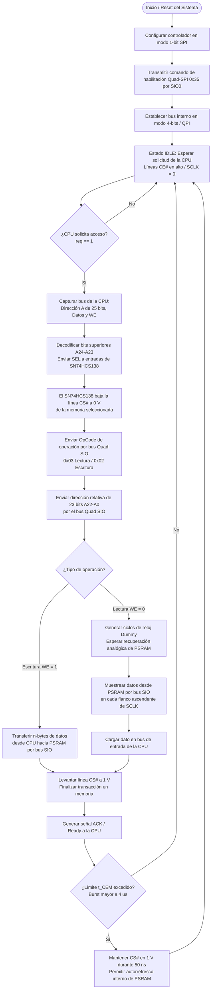
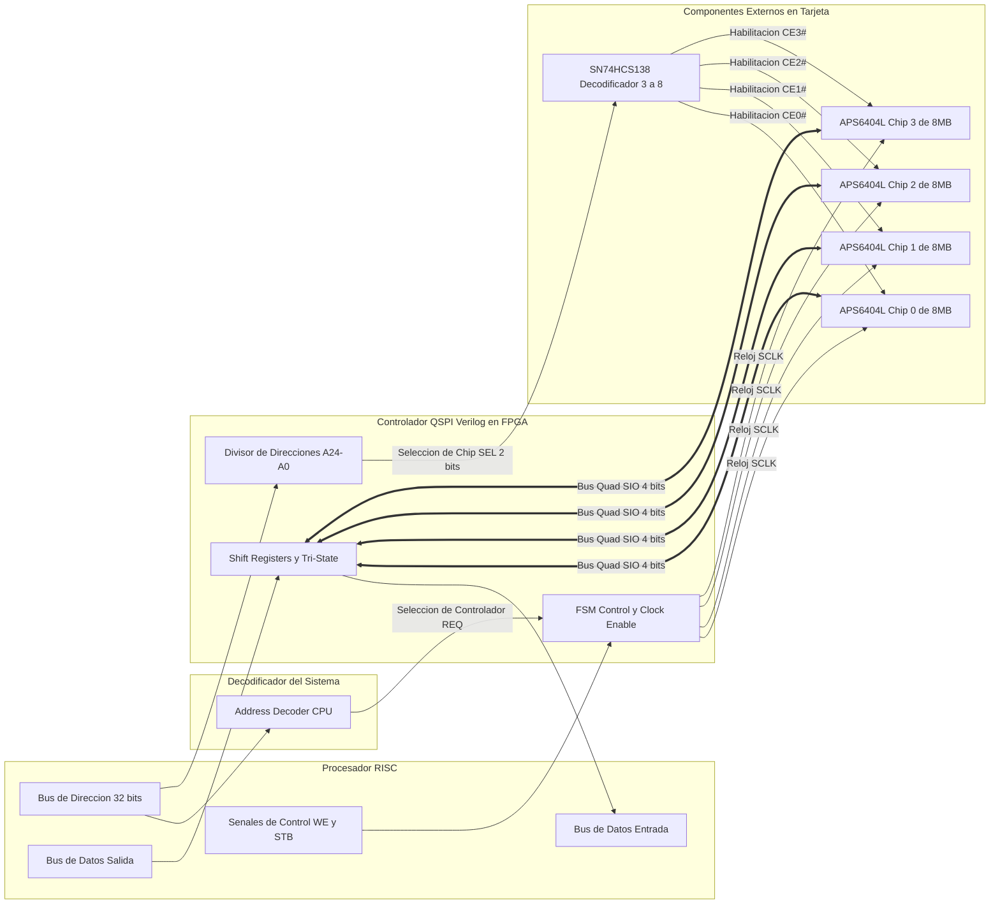

# SPIRAM_CTRL

Este espacio está reservado para la especificación de la información relevante del funcionamiento de la memoria RAM mediante protocolo `SPI`. 

Con base en esta imagen se puede determinar el tipo de módulo con el que se va a trabajar, y en consecuencia, empezar la creación de su diagrama.
En este sistema la memoria `RAM` va a trabajar como almacenador de información referente a variables de ejecución de algún programa. 

# Consideraciones. 

1. La información relevante del protocolo se encuentra en [Protocolo SPI](../spiram_ctrl.v/SPI%20Protocol.md)
2. La memoria `RAM` es un dispositivo externo y no es parte de la `FPGA`, sin embargo, el controlador que se desarrolla sí está en la `FPGA`. Se hace necesaria la aclaración para denotar que existen dos dominios; `BUS LOCAL` (lado `CPU`) que trabaja con el reloj del sistema generado por el oscilador de cristal y `BUS EXTERNO` (lado periféricos) que trabaja con un reloj independiente comandado por el protocolo -`SPI` en nuestro caso- con base en la capacidad del periférico en cuestión.
3. El dispositivo que se va a usar consiste en una `RAM` `QUAD-SPI` (para más información respecto a cómo funciona esto remitirse a [Protocolo SPI](/SPI%20Protocol.md). Consiste en un chip [`HCS138`](../Datasheets/SN74HCS138.pdf) (05EG3/M8K3) y 4 memorias [`APS6404L-3SQ`](../Datasheets/APS6404L-3SQR.pdf).

## Especificaciones Técnicas

Un vistazo rápido de los datos presentes en los datasheets pero relevantes para el controlador se muestran en las tablas. 

### Componentes de Memoria

| Componente | Parámetro Técnico | Valor / Especificación | Relevancia para el Controlador Verilog / FPGA |
| :--- | :--- | :--- | :--- |
| **Memoria PSRAM** (`APS6404L-3SQR`) *(4 integrados)* | **Organización / Capacidad** | $64\text{ Mbit}$ ($8\text{ MB}$) por chip. Total conjunto ($4 \times 8\text{ MB}$): **$32\text{ MB}$** ($256\text{ Mbit}$).  | Determina el tamaño total del mapa de memoria ($A[24:0]$) que el decodificador de la CPU debe direccionar. |
| | **Tensión de Trabajo ($V_{DD}$)** | $2.7\text{ V}$ a $3.6\text{ V}$ ($3.3\text{ V}$ nominal). | Define el nivel lógico de los I/O de la FPGA (`LVCMOS33`). Si la FPGA usa $1.8\text{ V}$ o $2.5\text{ V}$, requiere adaptación de nivel (*Level Shifter*). |
| | **Frecuencia de Reloj ($SCLK$)** | **Hasta $84\text{ MHz}$** en modo *Linear Burst* (cruza fronteras de página de $1\text{ KB}$). **Hasta $133\text{ MHz}$** en *32-Byte Wrapped Burst* (a $3.0\text{ V}$). | El divisor de reloj o *Clock Enable* en Verilog debe garantizar que $SCLK \le 84\text{ MHz}$ para operaciones de ráfaga lineal continua.|
| | **Protocolo e Interfaz** | SPI ($1\times \text{I/O}$) / QPI Quad-SPI ($4\times \text{I/O}$, $SIO[3:0]$). | La FSM en Verilog debe manejar transiciones entre $1\text{ bit/ciclo}$ (comando) y $4\text{ bits/ciclo}$ (dirección/datos en QSPI). |
| | **Gestión de Refresco** | Automático e Interno (*Self-Managed PSRAM*).  | **Ventaja crítica:** No se necesita implementar un controlador DRAM con ciclos de refresco periódicos en Verilog; la memoria se comporta como SRAM estática.  |
| | **Límite $t_{CEM}$ (Burst Duration)** | Máximo $\approx 4\mu\text{s}$ a $8\mu\text{s}$ con `CE#` activado continuo.  | La FSM debe desmarcar `CE#` (ponerlo en alto) tras completar un bloque de lectura/escritura para que la PSRAM ejecute su autorrefresco interno. |
| **Decodificador** (`SN74HCS138`) | **Función** | Decodificador / Demultiplexor de 3 a 8 líneas con entradas Schmitt-Trigger. | Actúa como selector de chip (*Chip Select*) enviando la señal `CE#` activa en bajo ($0\text{ V}$) a cada uno de los 4 chips de memoria según las líneas de selección. |
| | **Tensión de Trabajo ($V_{CC}$)** | $2.0\text{ V}$ a $6.0\text{ V}$ ($3.3\text{ V}$ o $5.0\text{ V}$ típicamente). | Garantiza compatibilidad de voltaje directo con los niveles $3.3\text{ V}$ provenientes de los pines de la FPGA y las memorias. |
| | **Tiempo de Propagación ($t_{pd}$)** | $\approx 9\text{ ns}$ a $15\text{ ns}$ (dependiendo de $V_{CC}$). | **Latencia del controlador:** Se debeañadir esta demora en el análisis de tiempos (*Setup/Hold*) de la señal `CE#` que sale de la FPGA antes de iniciar la primera instrucción $SCLK$. |
| | **Entradas Schmitt-Trigger** | Tolerancia e inmunidad al ruido en los flancos de conmutación. | Elimina rebotes o ruidos indeseados en las líneas de control que selecciona la CPU antes de llegar a la PSRAM. |

---

## Mapeo de Selección de Chip (Decodificador `SN74HCS138`)

| Selección Verilog (`SEL[1:0]`) | Salida Activa `SN74HCS138` | Memoria Habilitada | Rango de Direcciones Hexadecimal ($32\text{ MB}$ Total) |
| :---: | :---: | :---: | :---: |
| `2'b00` | $Y_0$ (`0V` / Bajo) | `APS6404L` Chip 0 ($8\text{ MB}$) | `0x0000_0000` — `0x007F_FFFF`  |
| `2'b01` | $Y_1$ (`0V` / Bajo) | `APS6404L` Chip 1 ($8\text{ MB}$) | `0x0080_0000` — `0x00FF_FFFF`  |
| `2'b10` | $Y_2$ (`0V` / Bajo) | `APS6404L` Chip 2 ($8\text{ MB}$) | `0x0100_0000` — `0x017F_FFFF`  |
| `2'b11` | $Y_3$ (`0V` / Bajo) | `APS6404L` Chip 3 ($8\text{ MB}$) | `0x0180_0000` — `0x01FF_FFFF`  |

## Mapeo físico del periférico

-Estamos trabajando en ello, el mapa se actualizará tan pronto como se confirmen las conexiones por ingeniería inversa-

# Diagrama de flujo 

Con base en la información presente en [Protocolo SPI](/SPI#20Protocol.md) y referenciando el hardware disponible se puede establecer el flujo del proceso que debe realizar el controlador durante la comunicación con la `CPU` y la `RAM`.

1. **Óvalos (`Inicio / Reset`):** Indican el arranque del hardware desde que la FPGA recibe alimentación o una señal de reset.
2. **Rectángulos (`Procesos`):**
   * **`Configurar / Transmitir QPI`:** Ocurren una sola vez al encender el sistema para pasar las memorias a modo de 4 bits.
   * **`Decodificar bits A[24:23]`:** Transforma la dirección de la CPU en las señales `SEL[1:0]` que van hacia el `SN74HCS138`.
   * **`El SN74HCS138 baja la línea CS#`:** Habilita el chip de memoria correcto *antes* de enviar la dirección y los datos.
3. **Rombos (`Decisiones`):**
   * **`¿CPU solicita acceso?`:** Evalúa si la CPU colocó una dirección válida asignada a la RAM.
   * **`¿Tipo de operación?`:** Divide el camino entre el ciclo de escritura directa o el ciclo de lectura (que requiere *Dummy Cycles* de espera antes de capturar el dato).
   * **`¿Límite t_CEM excedido?`:** Verifica si la transferencia fue demasiado larga para liberar `CE#` y permitir que la memoria se autorrefresque.

# Diagrama de bloques [IA sugerido. Sujeto a revisión]

Con base en la información presentada en el diagrama de flujo previo, se hace el diagrama de bloques correspondiente a dicho sistema. 

